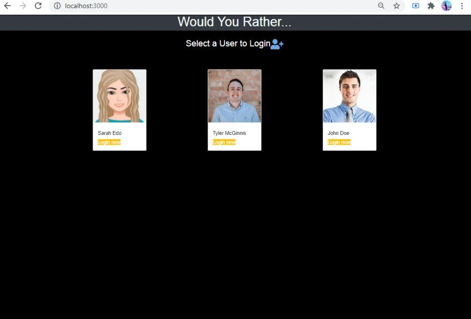

# Would You Rather?

### Table of contents:
 - [Overview](#overview)
 - [Getting Started](#getting-started)
 - [Output](#output)
 - [Copyright and License](#copyright-and-license)


#### Overview
-  this web app lets the user plays the “Would You Rather?” game. The game goes like this: A user is asked a question in the form: “Would you rather [option A] or [option B] ?”. Answering "neither" or "both" is against the rules.

- In this app, users will be able to answer questions, see which questions they haven’t answered, see how other people have voted, post questions, and see the ranking of users on the leaderboard, this project is a part of the Udacity's [ React Developer Nanodegree ](https://www.udacity.com/course/react-nanodegree--nd019?gclid=CjwKCAjw_o-HBhAsEiwANqYhp6-6aYf8QSkqRyii-89ommJxXLZhbgw5L8JO__KCf_D1La0Z2YEgAhoCyKAQAvD_BwE&utm_campaign=12908932988_c&utm_keyword=react%20udacity_e&utm_medium=ads_r&utm_source=gsem_brand&utm_term=124509195751).


#### Getting Started
``` 
npm install
```
``` 
npm start
```


#### Output

Login




Unanswered Questions


Answered Questions


Add New Question


Leaderboard


Unanswered Question Details


Answered Question Details


NotFound


#### Copyright and License
- supplied without rights, information contributed by [Udacity](http://www.udacity.com).

